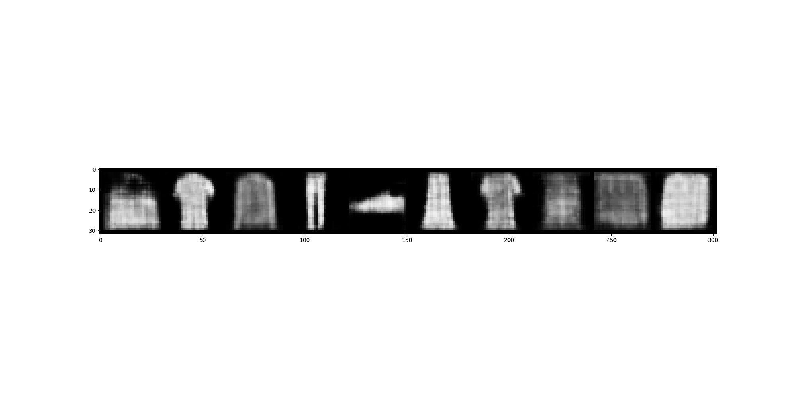
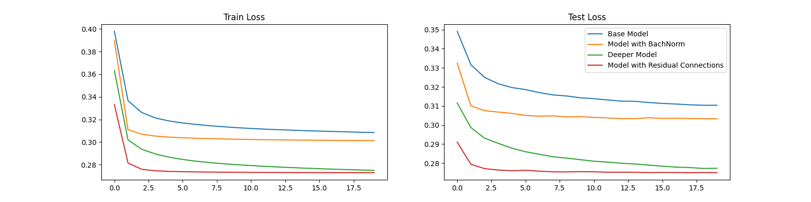

# FashionMnistDenoise
This is a showcase of my work in the course [Automatic Image Analysis](https://moseskonto.tu-berlin.de/moses/modultransfersystem/bolognamodule/beschreibung/anzeigen.html;jsessionid=f2bc9313687795144db8d784a70b?number=40345&version=1&sprache=2) at the Technical University Berlin for my Master's in Computer Science 2023. 
I applied a few different neural network structures to the [FashionMnist](https://github.com/zalandoresearch/fashion-mnist) dataset for a denoising task.Specifically, I have designed a ...
* Base Model (a small Convolutional neural net in the classic sense)
* Batch Norm Model (The base model with batch norm in addition)
* Deeper Model (a deeper neural net with Batch Norm than the base model)
* Residual Model (a neural net with residual connections)

# Results
Original Images:

Noisy Images:

Reconstruced (Base Model):

Reconstructed (Batch Norm Model)

Reconstructed (Deeper Model)

Reconstructed (Residual Model)

Train Results:
